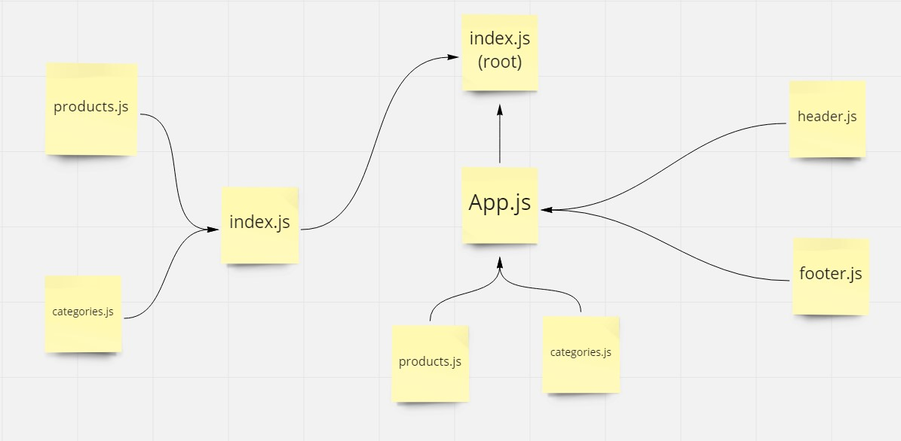

# Description

Create application simulates a virtual store to display products

# Features
- an App component that serves as the container for all sub-components of this application
- a component which shows the name of your virtual store
- a component which shows your copyright and contact information
- a component
  - shows a list of all categories
  - dispatches an action when one is clicked to “activate” it
- a component
- displays a list of products associated with the selected category

# UML

